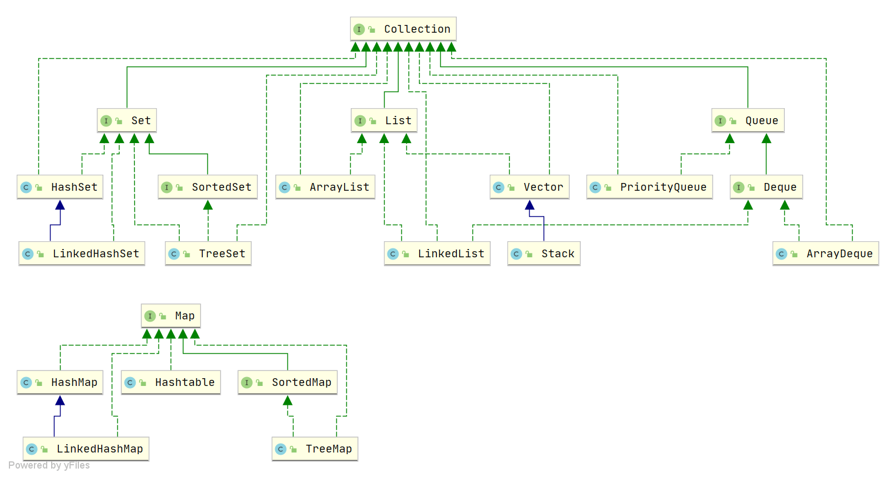

## 1. 简单介绍一下集合

Java 集合，也叫作容器，主要是由两大接口派生而来：
- 一个是 `Collection`接口，主要用于存放单一元素；另一个是 `Map` 接口，主要用于存放键值对。
- 对于`Collection` 接口，下面又有三个主要的子接口：`List`、`Set` 、 `Queue`、`Map`。

Java 集合框架如下图所示：

## 2. 说说 List, Set, Queue, Map 四者的区别？

- List(对付顺序的好帮手): 存储的元素是有序的、可重复的。
- Set(注重独一无二的性质): 存储的元素不可重复的。
- Queue(实现排队功能的叫号机): 按特定的排队规则来确定先后顺序，存储的元素是有序的、可重复的。
- Map(用 key 来搜索的专家): 使用键值对（key-value）存储，类似于数学上的函数 y=f(x)，"x" 代表 key，"y" 代表 value，key 是无序的、不可重复的，value 是无序的、可重复的，每个键最多映射到一个值。

## 3. 集合框架底层数据结构总结

先来看一下 `Collection` 接口下面的集合。

List

- `ArrayList`：`Object[]` 数组
- `Vector`：`Object[]` 数组
- `LinkedList`：双向链表(JDK1.6 之前为循环链表，JDK1.7 取消了循环)

Set

- `HashSet`(无序，唯一): 基于 `HashMap` 实现的，底层采用 `HashMap` 来保存元素。
- `LinkedHashSet`: `LinkedHashSet` 是 `HashSet` 的子类，并且其内部是通过 `LinkedHashMap` 来实现的。
- `TreeSet`(有序，唯一): 红黑树(自平衡的排序二叉树)。

Queue

- `PriorityQueue`: `Object[]` 数组来实现小顶堆。
- `DelayQueue`:`PriorityQueue`。
- `ArrayDeque`: 可扩容动态双向数组。

再来看看 `Map` 接口下面的集合。

Map

- `HashMap`：JDK1.8 之前 `HashMap` 由数组+链表组成的，数组是 `HashMap` 的主体，链表则是主要为了解决哈希冲突而存在的（“拉链法”解决冲突）。JDK1.8 以后在解决哈希冲突时有了较大的变化，当链表长度大于阈值（默认为 8）（将链表转换成红黑树前会判断，如果当前数组的长度小于 64，那么会选择先进行数组扩容，而不是转换为红黑树）时，将链表转化为红黑树，以减少搜索时间。
- `LinkedHashMap`：`LinkedHashMap` 继承自 `HashMap`，所以它的底层仍然是基于拉链式散列结构即由数组和链表或红黑树组成。另外，`LinkedHashMap` 在上面结构的基础上，增加了一条双向链表，使得上面的结构可以保持键值对的插入顺序。同时通过对链表进行相应的操作，实现了访问顺序相关逻辑。
- `Hashtable`：数组+链表组成的，数组是 `Hashtable` 的主体，链表则是主要为了解决哈希冲突而存在的。
- `TreeMap`：红黑树（自平衡的排序二叉树）。

## 4.如何选用集合?

我们主要根据集合的特点来选择合适的集合。比如：

- 我们需要根据键值获取到元素值时就选用 `Map` 接口下的集合，需要排序时选择 `TreeMap`,不需要排序时就选择 `HashMap`,需要保证线程安全就选用 `ConcurrentHashMap`。
- 我们只需要存放元素值时，就选择实现`Collection` 接口的集合，需要保证元素唯一时选择实现 `Set` 接口的集合比如 `TreeSet` 或 `HashSet`，不需要就选择实现 `List` 接口的比如 `ArrayList` 或 `LinkedList`，然后再根据实现这些接口的集合的特点来选用。

## 5.为什么要使用集合？

当我们需要存储一组类型相同的数据时，数组是最常用且最基本的容器之一。 但是，使用数组存储对象存在一些不足之处，因为在实际开发中，存储的数据类型多种多样且数量不确定。 这时，Java 集合就派上用场了。与数组相比，Java 集合提供了更灵活、更有效的方法来存储多个数据对象。Java 集合框架中的各种集合类和接口可以存储不同类型和数量的对象，同时还具有多样化的操作方式。相较于数组，Java 集合的优势在于它们的大小可变、支持泛型、具有内建算法等。总的来说，Java 集合提高了数据的存储和处理灵活性，可以更好地适应现代软件开发中多样化的数据需求，并支持高质量的代码编写。

### 6. ArrayList 和 LinkedList 有什么区别？

它们的区别有以下几个：

1. 数据结构实现不同：ArrayList 是动态数组的数据结构实现，而 LinkedList 是双向链表的数据结构实现。
2. 随机访问效率不同：ArrayList 比 LinkedList 在随机访问的时候效率要高，因为 LinkedList 是线性的数据存储方式，所以需要移动指针从前往后依次查找。
3. 增加和删除效率不同：在非首尾的增加和删除操作，LinkedList 要比 ArrayList 效率要高，因为 ArrayList 增删操作要影响数组内的其他数据的下标。

综合来说，在需要频繁读取集合中的元素时，更推荐使用 ArrayList，而在插入和删除操作较多时，更推荐使用 LinkedList。

### 7. Vector 和 ArrayList 有什么区别？

它们的区别有以下几个：

1. 线程安全方面：Vector 使用了 Synchronized 来实现线程同步，是线程安全的，而 ArrayList 是非线程安全的；
2. 性能方面：ArrayList 在性能方面要优于 Vector；
3. 扩容方面：ArrayList 和 Vector 都会根据实际的需要动态的调整容量，只不过在 Vector 扩容每次会增加 1 倍，而 ArrayList 只会增加 50%。

### 8. Array 和 ArrayList 一样吗？

二者是不同的，Array 是数组，ArrayList 是集合，它们的区别有以下几个：

1. Array 可以存储基本数据类型和对象，ArrayList 只能存储对象；
2. Array 是指定固定大小的，而 ArrayList 大小是自动扩展的；
3. Array 内置方法没有 ArrayList 多，比如 addAll、removeAll、iteration 等方法只有 ArrayList 有。

### 9. 如何实现数组和 List 转换？

1. 数组转 List：使用 Arrays.asList(array) 进行转换。
2. List 转数组：使用 List 自带的 toArray() 方法。

### 10. Collection 和 Collections 有什么区别？

Collection 和 Collections 的区别如下：

1. Collection 是集合类的上级接口，继承它的主要有 List 和 Set；
2. Collections 是针对集合类的一个帮助类，它提供了一些列的静态方法实现，如 Collections.sort() 排序、Colle